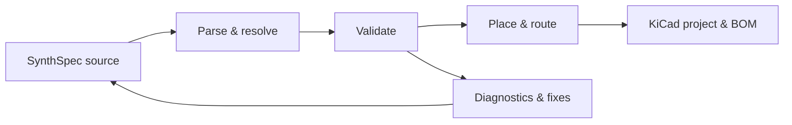

<div align="center">


# Synth

### Design circuit boards as code.

Turn text-based circuit designs into KiCad schematics, PCB layouts, and bills of materials.

Open source. Built for engineers and AI agents.

[Quick Start](#quick-start) · [Features](#features) · [Examples](#examples) · [Documentation](#documentation) · [Contributing](#contributing)

</div>

## Introduction

Synth is an open-source compiler for electronic circuit boards. Describe your components, their connections, and board constraints in **SynthSpec**, a text-based design language. Synth checks the design and generates KiCad schematics, PCB layouts, and a bill of materials.

This brings a software development workflow to hardware: edit designs in your usual editor, review changes in Git, and run automated checks. Your `.synth` files capture the design intent; the schematic and board layout are generated outputs you can inspect in KiCad.

Engineers can use Synth from the command line. AI agents can use its **Model Context Protocol (MCP)** server to find components, validate circuits, and generate outputs through the same compiler, with structured diagnostics to guide corrections.

## Why Synth?

- **Review hardware changes in Git.** Components, connections, and constraints are text, making design intent visible in diffs and pull requests.
- **Check designs as you build.** Structured diagnostics identify problems and provide source locations and suggested fixes where available.
- **Keep outputs reproducible.** A typed compiler pipeline and deterministic placement and routing make generated artifacts repeatable.
- **Work with KiCad.** Export schematics, PCBs, and BOMs for inspection and downstream workflows.
- **Give agents concrete tools.** Expose validation, registry search, placement, routing, and export through MCP.

## How It Works



Synth resolves parts from a component registry and lowers the source into a typed board representation. Compiler stages use that shared representation for electrical checks, layout, routing, and export. A local browser viewer displays the schematic and diagnostics as you edit.

## Features

| Area | Capabilities |
| --- | --- |
| Design language | SynthSpec parser, typed board IR, components, connections, differential pairs, keepouts, and placement hints |
| Validation | Electrical-rule checks, design-rule checks, structured diagnostics, and SMT-backed quantitative fixes |
| Layout and routing | Deterministic schematic layout, component placement, and multilayer routing |
| KiCad integration | Project, schematic, PCB, and BOM export; optional fabrication outputs through `kicad-cli` |
| Component registry | Versioned parts, project and user overlays, search, import, and authoring tools |
| Developer tools | CLI, live browser preview, JSON diagnostics, and an MCP server for agent integration |

## Quick Start

Use a current stable Rust toolchain with Cargo. Run the following from a local checkout:

```bash
git clone https://github.com/absmach/synth.git
cd synth
cargo build -p synth-cli
cargo run -p synth-cli -- --help
```

Validate the minimal example and export a KiCad project:

```bash
cargo run -p synth-cli -- validate fixtures/designs/hello.synth
cargo run -p synth-cli -- export-kicad fixtures/designs/hello.synth --out output/hello
```

The minimal example declares an empty two-layer board. Use the [example designs](#examples) to explore circuits with components and connections.

For machine-readable diagnostics:

```bash
cargo run -p synth-cli -- validate examples/env_logger.synth --format json
```

Open exported projects in KiCad. Optional Gerber, drill, and STEP exports require `kicad-cli`; see the [KiCad workflow guide](docs/kicad-workflows.md) for export and review details.

### Live Preview

Build the browser assets using the prerequisites and instructions in the [viewer guide](crates/synth-web/README.md), then run:

```bash
cargo run -p synth-cli -- preview examples/env_logger.synth
```

Open the local URL printed by the command. Save changes to the `.synth` file in your editor to refresh the schematic and diagnostics.

### Agent Integration

Start the MCP server over standard input and output:

```bash
cargo run -p synth-cli -- mcp --stdio
```

Agents can retrieve the SynthSpec language reference, search the registry, validate designs, apply fixes, and invoke compiler stages. See the [MCP guide](crates/synth-mcp/README.md) for transports and tool details.

## Examples

| Design | What it demonstrates |
| --- | --- |
| [Hello](fixtures/designs/hello.synth) | The smallest board declaration |
| [Environmental logger](examples/env_logger.synth) | USB-C power, a regulator, an MCU, an environmental sensor, and a debug header |
| [Sensor logger](examples/sensor_logger.synth) | A larger design with dual I²C sensors, SPI flash, and status LEDs |
| [Placement and differential pairs](examples/placement_and_diff_pair.synth) | Placement hints, differential-pair constraints, and keepout regions |

Additional language and validation cases live in [fixtures](fixtures/designs/README.md). Part definitions live in the [component registry](registry/README.md).

## Documentation

- [KiCad workflows](docs/kicad-workflows.md) — exported projects, validation, BOMs, and fabrication outputs.
- [Schematic procedures](docs/schematic-procedures.md) — schematic generation and review.
- [Diagnostic reference](docs/diagnostics/README.md) — diagnostic codes and repair guidance.
- [Diagnostic protocol](docs/protocol-v1.0.md) — the machine-readable diagnostic format.
- [Component registry](registry/README.md) — part definitions and registry structure.
- [Browser viewer](crates/synth-web/README.md) — build and run the live preview.
- [MCP server](crates/synth-mcp/README.md) — agent tools and integration.

## Contributing

Contributions to the compiler, component registry, examples, and documentation are welcome. Use [issues](https://github.com/absmach/synth/issues) to report bugs or discuss a change, and submit a pull request with a focused description and relevant validation.

Before submitting code, run the workspace checks:

```bash
make verify
```

This checks formatting, compilation, Clippy lints, the workspace tests, and registry tests. Run `make help` to see individual development commands.

## License

Synth is licensed under the [Apache License 2.0](LICENSE).
