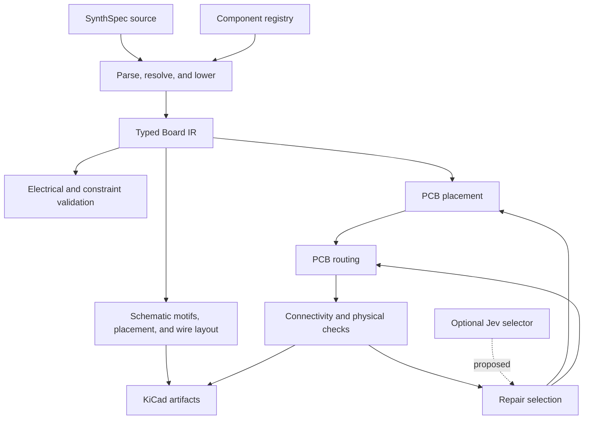

# Internal assessment: Jev in Synth

**Date:** 2026-09-21

**Status:** Technical assessment and proposed experiment; no Jev integration or benchmark completed.

**Code baseline:** `27284cee678d12db541cca2ac4b7ca699cebd20d`

**Audience:** Synth compiler, schematic, placement, routing, and agent-tooling maintainers.

## 1. Recommendation

Evaluate TypeSafe's Jev as an optional selector of bounded repair actions around Synth's placement and routing engines. The strongest initial hypothesis is that it can reduce expensive unsuccessful repair attempts by choosing an appropriate next action from circuit context and failure evidence.

Synth should generate the candidate actions, execute them, and judge their results using connectivity, geometry, constraints, and design-rule checks. Jev would supply a selection or ranking, not establish electrical or physical correctness.

Before investing in integration, establish an accurate deterministic baseline and improve the metrics used to compare candidates. A better evaluator and a more targeted conventional repair policy could deliver much of the benefit on their own.

| Area | Proposed use | Priority | Evidence needed |
| --- | --- | --- | --- |
| Placement/routing repair | Select the next bounded repair action | First experiment | More fully connected, DRC-clean boards within the same time budget |
| Component placement | Select among legal floorplan candidates or hint bundles | High, after evaluator improvements | Better routed outcomes and constraint satisfaction |
| Schematic generation | Rank semantic grouping and readability choices | Medium | Human preference plus unchanged connectivity and measured layout quality |
| Compiler diagnostics | Rank existing fixes using circuit context | Medium | Higher repair success with fewer trials and no new blocking diagnostics |
| Parsing, lowering, connectivity, SMT, and DRC | No proposed model authority | Preserve existing deterministic behavior | Existing correctness tests and independent checks |
| Routing cell expansion | No hosted inference inside the search | Excluded | Local, inexpensive cost evaluation remains necessary |

These priorities are engineering judgments from source inspection. They are not measured claims about Jev's EDA competence.

## 2. Scope, evidence, and corrections to the initial discussion

This assessment covers the local Synth code and TypeSafe's public documentation examined during the investigation. No Jev API request, model calibration study, compiler performance profile, or board-quality benchmark was performed. Documentation work did not modify the compiler or its algorithms.

The checkout changed between the initial discussion and preparation of this document. The current repair loop already includes improvements that were missing in the earlier inspected implementation:

| Earlier observation | Current baseline |
| --- | --- |
| Candidate selection considered only unrouted-net count | `physical_score` considers unrouted nets first and independent Synth DRC violations once routing is complete |
| Repeated endpoint visits could rotate a component several times per iteration | Implicated component IDs are deduplicated in a `BTreeSet` |
| Repair targeted only components on unrouted nets | For fully routed candidates, DRC witnesses and suggested overrides also guide repair |
| Margin increased by 0.5 mm per attempt | Margin now increases by 1.0 mm per attempt |
| Export requested five repair iterations | The export call now requests eight; its adjacent comment still says five |

The earlier missing deduplication and missing DRC scoring must not be treated as outstanding implementation tasks. The experiment should compare against the current code, not against that weaker historical description.

Source: [`export.rs`](../crates/synth-kicad/src/export.rs), especially `place_and_route_with_repair`, `physical_score`, and the export call site.

## 3. What Jev can contribute

Jev accepts state and typed questions. Its documented primitives are `Choice`, `Score`, and `Noul`: selecting an option, evaluating a rubric, and estimating the probability of a proposition. This maps naturally to selecting a candidate action from a finite set. [TypeSafe introduction](https://docs.typesafe.ai/introduction)

Jev currently accepts text and structured text, including JSON. It does not accept images and does not generate code or explanations. A schematic or PCB assessment would therefore require a structured description of topology, geometry, constraints, and observed failures. The provider also states that calibration across predictions does not guarantee correctness for an individual answer. [System One documentation](https://docs.typesafe.ai/concepts/system-one)

The proposed use is an empirical hypothesis: semantic circuit information may help select a useful action when several deterministic alternatives are available. A task-specific rule set or small local predictor may perform equally well or better. The evaluation must include those alternatives.

Confidence should govern fallback behavior only after measuring it on representative Synth tasks. A confident answer is not a substitute for rerunning the compiler and physical checks. [Confidence documentation](https://docs.typesafe.ai/confidence)

## 4. Relevant Synth architecture

The useful separation is between circuit meaning, schematic presentation, and PCB geometry:



The diagram shows responsibility boundaries, not a guarantee that every export path runs every check. In particular, returning the best available repair candidate does not mean that candidate is clean.

| Responsibility | Relevant implementation |
| --- | --- |
| Typed circuit representation | [`synth-ir`](../crates/synth-ir/src/lib.rs) |
| Authoritative declared connectivity | [`synth-connectivity`](../crates/synth-connectivity/src/lib.rs) |
| Electrical rules and patch previews | [`synth-validate`](../crates/synth-validate/src/lib.rs) |
| Schematic cluster placement interface | [`synth-layout/src/placer.rs`](../crates/synth-layout/src/placer.rs) |
| Schematic quality metrics | [`synth-layout/src/score.rs`](../crates/synth-layout/src/score.rs) |
| Structured schematic edits | [`synth-layout/src/ops.rs`](../crates/synth-layout/src/ops.rs) |
| PCB placement and semantic hints | [`synth-place/src/lib.rs`](../crates/synth-place/src/lib.rs) |
| Coarse placement optimization | [`synth-place/src/cem.rs`](../crates/synth-place/src/cem.rs) |
| PCB maze routing | [`synth-route/src/maze.rs`](../crates/synth-route/src/maze.rs) |
| Manufacturer-profile DRC | [`synth-drc`](../crates/synth-drc/src/lib.rs) |
| Export repair orchestration | [`synth-kicad/src/export.rs`](../crates/synth-kicad/src/export.rs) |
| Agent-facing operations | [`synth-mcp/src/tools.rs`](../crates/synth-mcp/src/tools.rs) |

## 5. First experiment: placement and routing repair

### 5.1 Current behavior

`place_and_route_with_repair` creates an initial placement and routing, then evaluates a physical score using the JLC standard manufacturer profile. Its score is a lexicographically ordered pair:

```text
If routing is incomplete:
    (unrouted_net_count, usize::MAX)
Otherwise:
    (0, independent_synth_drc_violation_count)
```

The independent check here is `synth_drc::check`, rather than the router's own clearance bookkeeping. It is not an invocation of external KiCad DRC.

The loop stops when the score is `(0, 0)`. Otherwise, it collects implicated components from unrouted nets, or from DRC evidence for fully routed candidates. Exact rotation suggestions from DRC take precedence over cyclic rotation overrides. Each implicated component is considered once per iteration.

It then increases the global margin, reruns placement with rotation overrides and the sidecar, routes the result, and accepts a strictly smaller physical score. Two consecutive unsuccessful attempts terminate the loop. Export currently allows up to eight repair iterations, in addition to the initial attempt.

The loop retains and returns its best candidate even if the candidate still has unresolved failures. This behavior must remain visible in evaluation results.

### 5.2 Remaining opportunity

The current policy has stronger correctness feedback than the initial version, but still explores a narrow sequence of actions. Global margin expansion and broad rotation changes may be inefficient for a local escape problem or a poor module arrangement.

Potential candidate actions include:

| Action | Existing foundation | Additional work |
| --- | --- | --- |
| Rotate one selected footprint | Rotation overrides | Generate legal alternatives and respect orientation constraints |
| Apply an exact DRC rotation suggestion | Already supported in the loop | Preserve as a strong deterministic baseline |
| Increase global spacing | Existing margin tuning | Expose bounded choices and record resulting board size |
| Increase spacing around one module | Functional module extraction | Implement local spacing controls; this is not an existing repair action |
| Try an alternate module arrangement | Floorplanning and placement hints | Generate and validate candidate hint bundles |
| Prioritize a blocked net for rerouting | Router contains priority recovery logic | Expose an explicit selectable policy boundary |
| Use the current repair policy | Existing implementation | Retain as fallback |

Jev should choose among candidates that already contain their parameters. For example, it can choose `rotate_U3_90`, whose legality and geometry are known to Synth. It should not be responsible for inventing a coordinate tuple or an arbitrary source patch.

### 5.3 Information available to the selector

Build a compact state containing:

- Board dimensions, layer count, active manufacturer profile, and fixed constraints.
- Relevant components, roles, footprints, orientations, and local connections.
- Failed-net source and target pad witnesses.
- DRC rule IDs, implicated components, and exact suggestions where available.
- Computed local density or congestion summaries, when implemented.
- Previously attempted actions and their measured outcomes.
- Candidate IDs, effects, estimated execution cost, and remaining budget.

Existing unrouted witnesses identify endpoints; they do not by themselves prove which obstacle caused the failure. Label derived summaries as observations or estimates, rather than asserting a root cause that the router has not established.

### 5.4 Candidate evaluation

Preserve completeness and physical validity as primary outcomes. Compare aesthetic or efficiency improvements among candidates that meet the same validity requirements.

For feasible candidates, additional metrics can include trace length, via count, differential-pair compliance, board area, and elapsed time. Do not allow a weighted aesthetic score to compensate for an open connection or violated hard constraint.

When repair is still incomplete, a richer search objective may help escape plateaus, but that objective needs separate evaluation. Its value must not be reported as successful board completion.

## 6. Component placement

### 6.1 Existing mechanisms and integration boundaries

The PCB placer already combines functional modules, semantic floorplan targets, Cross-Entropy Method (CEM) region suggestions, placement hints, and legal-position search. See [`modules.rs`](../crates/synth-place/src/modules.rs), [`floorplan.rs`](../crates/synth-place/src/floorplan.rs), and [`cem.rs`](../crates/synth-place/src/cem.rs).

Target precedence matters. In the inspected placement path, explicit hints and module relationships take precedence over semantic floorplan targets, which in turn precede CEM suggestions. Improving CEM suggestions will have little effect for components whose targets are already supplied by an earlier source. Instrument which source actually controls each component before optimizing that source.

[`PlacementAdvisor`](../crates/synth-place/src/advisor.rs) declares `evaluate_bias` and a neutral default implementation. Repository search found no placement call sites for that method. Implementing a Jev-backed advisor alone would therefore not change placement behavior.

The existing MCP tools `synth_place_with_hints` and `synth_describe_placement` are a more concrete prototype boundary. The former executes placement, routing, and DRC reporting; the latter supplies a semantic summary. A prototype must still check the final geometry after sidecar application rather than assume an earlier hint report describes the final state.

### 6.2 Useful model decisions

Generate a small portfolio of legal module arrangements or hint bundles locally. Ask the selector which arrangement to evaluate first based on declared intent, such as connector accessibility or functional grouping. Compute geometric distances locally and include the results as evidence.

Claims about analog isolation, RF quality, thermal behavior, or signal integrity require appropriate constraints and physical analysis. Jev's judgment cannot establish those properties from component names and approximate positions.

### 6.3 Improve placement scoring first

[`score_placement`](../crates/synth-place/src/score.rs) currently exposes wire-length estimates, decoupling distances, a top-region passive ratio, connector distance, and `passes_human_quality_gate`. Source inspection shows several limitations:

1. **Decoupling association is broad.** For each required-decoupling entry, the code walks nets mentioning the IC and considers connected capacitors. It does not match each requirement to its intended capacitor and power pin.
2. **Distances use component centers.** The measurement is Manhattan distance between component centers, not capacitor-pad to IC-power-pad distance or routed power-loop geometry.
3. **Associations can be counted repeatedly.** Multiple requirements or shared nets can repeat the same capacitor/IC association.
4. **Connector distance is reported but omitted from the Boolean gate.** It is also measured from the component center, not its mating face.
5. **Comments and thresholds disagree.** Introductory comments describe a decoupling limit below 3 mm and a 0% top-region passive ratio; the gate uses at most 5 mm and at most 40%.
6. **The passive-ratio metric is stylistic.** A low value does not establish electrical quality, and a high value is not inherently an electrical defect.

Define requirement-specific associations, measure pad geometry where appropriate, deduplicate observations, and separate hard requirements from stylistic preferences. Represent missing evidence explicitly. Avoid interpreting a zero distance aggregate as success when no required association was found.

The scorer exists, but it is not the export loop's `physical_score`. An experiment must explicitly choose and record its evaluator rather than assume every exported quality field influences repair.

## 7. PCB routing

### 7.1 Keep hosted calls outside cell expansion

[`CongestionAdvisor`](../crates/synth-route/src/advisor.rs) is an active extension point. Its `evaluate_cell_cost` method is called during A* neighbor expansion in [`maze.rs`](../crates/synth-route/src/maze.rs).

A hosted request at that boundary would add network latency to repeated local search operations. Use a local cost lookup there. If an outer selector chooses a regional guidance policy, prepare and freeze its local cost representation before starting the routing pass.

Jev should not be asked to evaluate individual cells or every CEM sample. The integration should operate at the scale of board attempts, regions, modules, or repair steps.

### 7.2 Candidate routing decisions

Potential outer-loop choices include routing priority presets, recovery effort, which congested area to address next, and whether the next attempt should change placement. Some require new parameterized interfaces; they are not all exposed by the current public API.

Prefer model decisions for uncertain strategy choices. Use exact code for track clearance, coordinate transforms, collision checks, path lengths, and already-defined net priorities.

[`Routing`](../crates/synth-route/src/lib.rs) already includes segments, vias, differential-pair reports, unrouted witnesses, and `cells_expanded`. These support both input summaries and outcome measurement. Add pass-level timing and recovery-attempt traces if needed; they are proposed instrumentation.

## 8. Schematic generation and readability

### 8.1 Current foundations

Synth recognizes circuit motifs, places their clusters, and routes and labels connections. [`Placer`](../crates/synth-layout/src/placer.rs) separates cluster placement from subsequent shared processing. The shipped implementation is `NativeSemanticPlacer`, and the interface explicitly requires deterministic output.

[`LayoutOp`](../crates/synth-layout/src/ops.rs) supports moving and rotating components, grouping a block, replacing a wire with labels, and rerouting. These presentation operations leave the `Board` connectivity source unchanged.

[`LayoutScore`](../crates/synth-layout/src/score.rs) measures crossings, total wire length, and label stubs. Its `aesthetic_violations` field is empty in the base scorer; the CLI scoring path separately fills it using schematic ERC. A new evaluation harness must compose the same checks rather than interpret the base scorer's empty vector as proof of aesthetic validity.

### 8.2 Potential Jev contribution

Evaluate bounded semantic questions about proposed alternatives:

- Which block ordering best communicates a declared signal flow?
- Which valid grouping most clearly associates supporting parts with their functional block?
- Which proposed wire-to-label change preserves an understandable local signal path?

Provide component roles, cluster membership, net semantics, relative positions, and exact layout metrics. Jev can choose an operation or candidate identifier; Synth supplies coordinates and executes the edit.

Minimizing crossings alone can favor excessive labels, while minimizing label count can produce unreadable wires. A semantic selector may help navigate that tradeoff, but readable output must be evaluated by engineers as well as geometric checks.

### 8.3 Limitations and prerequisites

Jev cannot inspect the rendered image. Text-based evaluation cannot establish that it would detect every visual defect visible to a human.

The existing layout-operation implementation also documents a persistence limitation: structural operations reroute the whole schematic, and a previous forced wire-to-label choice may revert. Fix override persistence or explicitly reconstruct the intended operation sequence before using a multi-step selector.

Preserve the deterministic `Placer` contract. Make any model selection an explicit outer input, and support replay of that selection. Hiding a live network decision inside `Placer::place` would weaken reproducibility.

## 9. Compiler and diagnostic improvement

Parsing, resolving symbols, lowering into IR, determining connectivity, and solving explicit constraints are defined computations. The current assessment offers no evidence that Jev improves their execution speed or correctness.

The useful compiler-adjacent opportunity is choosing among existing suggested fixes. [`run_erc`](../crates/synth-validate/src/lib.rs) populates patch-consequence previews using an embedded [`PatchMlp`](../crates/synth-validate/src/patch_mlp.rs). The current call supplies diagnostic codes and patch kind; its wrapper defaults component context to `other` and net context to `signal`, despite the model exposing a contextual prediction method.

A fair sequence of experiments is:

1. Supply accurate context to the existing local predictor where available.
2. Measure a deterministic fix-priority policy.
3. Let Jev rank the same fixes with relevant circuit context and design intent.
4. Apply selected fixes to temporary source copies and reparse, lower, and validate them.

Score actual repair outcomes. A patch that removes a diagnostic by deleting intended circuitry is not necessarily a successful repair, so preserve explicit design requirements in the acceptance criteria.

Jev does not generate code. Any role in improving Synth's Rust implementation would be an auxiliary classification or review signal whose value also needs evaluation. Conventional profiling, regression tests, and code review remain the appropriate starting points for compiler performance work.

## 10. Proposed integration architecture

The following interfaces and records are proposals, not existing APIs.

```text
Board + constraints + current result + repair history
    -> deterministic candidate generation
    -> admissibility checks
    -> optional selector
         - fixed heuristic
         - local predictor
         - Jev
    -> execute selected candidate
    -> validate and measure
    -> retain best result and append trace
```

### 10.1 Candidate and decision records

An illustrative local record could look like:

```json
{
  "schema_version": 1,
  "board_revision": "<content-hash>",
  "attempt": 2,
  "candidates": [
    {
      "id": "rotate_U3_90",
      "action": "rotate_component",
      "component": "U3",
      "rotation_deg": 90
    },
    {
      "id": "fallback",
      "action": "current_repair_policy"
    }
  ]
}
```

This is a proposed Synth record, not a complete Jev HTTP request. Use the provider's documented state-and-questions API when implementing the adapter. [Official quick start](https://docs.typesafe.ai/introduction/quickstart)

Candidate construction must honor fixed placements, explicit dimensions, keepouts, hard hints, and required orientations. Allow only known candidate IDs in the response. On timeout, unavailable service, rejected output, or insufficiently supported selection, use the deterministic fallback.

### 10.2 Reproducibility

Record the following for each decision:

- Synth revision, registry and library inputs, board and sidecar hashes.
- Manufacturer profile, fixed board constraints, and candidate-generation version.
- Exact canonical state, candidate set, and rubric version.
- Resolved model version, returned values, and confidence where supplied.
- Selected action, fallback reason, elapsed time, and measured outcome.

Cache and replay decisions using all inputs that can affect them. A model version pin alone should not be treated as a byte-for-byte reproducibility guarantee. Keep ordinary deterministic compilation and tests usable without live model access.

### 10.3 Deployment boundary

Start with a development harness or explicit experimental command. Keep provider authentication and asynchronous requests in an adapter or orchestration layer. The synchronous geometry and search routines should receive already-resolved decisions or local guidance tables.

For hosted inference, send the structured evidence needed for the question. Make the use of remote inference explicit for designs whose circuit information is confidential. This is a deployment consideration for the optional feature, not a reason to change local compilation behavior.

## 11. Benchmark design

### 11.1 Hypothesis and comparison arms

**Primary hypothesis:** Given the same candidate actions and end-to-end budget, Jev chooses repairs that produce more fully connected, DRC-clean boards, or reaches the same quality with less total effort.

Compare:

| Arm | Purpose |
| --- | --- |
| Current checked-in repair loop | Product baseline |
| Improved deterministic action policy | Controls for gains from better actions and instrumentation |
| Jev selecting the same action set | Measures incremental model value |
| Optional local predictor | Tests whether learned selection needs hosted inference |
| Exhaustive evaluation on tractable cases | Estimates the opportunity available within the candidate set |

Give the deterministic and Jev selectors identical candidate sets. Separately report the cost of generating those candidates. Otherwise, gains from adding better actions could be incorrectly attributed to the model.

### 11.2 Corpus and split

Start with repository examples, layout fixtures, placement-error fixtures, and routing regression cases. Existing tests provide correctness coverage, but they are not automatically a representative optimization benchmark.

Include sparse and dense boards, connector-constrained designs, multilayer routing, differential pairs, module interactions, and deliberately infeasible constraints. Add unseen board families for generalization.

Split by design family, not by small perturbations of the same board. Keep related netlist and placement variants together to avoid near-duplicate leakage. Use separate development, threshold-calibration, and final evaluation sets.

Freeze board dimensions, layer counts, rule profiles, and permitted component changes across arms. If board area is allowed to grow, report that as a design tradeoff; completion on a larger board is not an equal-constraint improvement.

### 11.3 Metrics

| Category | Metrics |
| --- | --- |
| Primary success | Fraction fully connected and DRC-clean within budget, with hard constraints satisfied |
| Residual failure | Unrouted count, unresolved DRC categories, constraint failures |
| Physical quality | Trace length, vias, differential-pair compliance, board dimensions |
| Search effort | Place/route attempts, cells expanded, time spent per stage |
| Model overhead | Request latency, timeouts, token usage, API cost, fallback rate |
| Diagnostic repair | Valid fixes completed, new failures introduced, design intent preserved |
| Schematic readability | Blind engineer preference plus exact layout and ERC metrics |
| Reproducibility | Replay matches, stable fallback behavior, consistent recorded inputs |

Report both equal-attempt and equal-wall-clock results, with wall-clock including model overhead. Distinguish cold calls from cached or replayed decisions. Use paired comparisons by board, disclose sample size, and report uncertainty rather than relying only on averages.

For representative final artifacts, compare Synth's conclusions with KiCad ERC/DRC where available. Neither a model prediction nor a single in-process score should be used as the only evidence of exported-artifact correctness.

### 11.4 Promotion criteria

Set quantitative thresholds before examining the final held-out results. Promotion requires:

1. No accepted candidate bypasses hard constraints or suppresses unresolved validation failures.
2. A useful held-out improvement over the improved deterministic policy under the same budget.
3. No unacceptable regressions concentrated in an important board family.
4. Model latency and cost do not erase the measured benefit.
5. Reproducible replay and a working offline fallback.

If Jev fails these criteria, retain useful improvements to candidate generation, metrics, and deterministic repair independently. A negative result is a reason to omit the selector, not to discard better engineering infrastructure.

## 12. Suggested implementation sequence

| Phase | Deliverable | Completion evidence |
| --- | --- | --- |
| 1. Freeze baseline | Versioned corpus, current repair traces, corrected stale comments | Repeatable baseline with explicit failures |
| 2. Strengthen evaluation | Requirement-aware placement metrics and composed physical/schematic checks | Focused regression cases for misleading scores |
| 3. Expose actions | Bounded repair candidates and deterministic selector | Same constraints and auditable outcomes for every candidate |
| 4. Add experimental Jev adapter | Outer-loop selection, timeout, fallback, trace, and replay | Adapter tests using recorded or synthetic responses |
| 5. Run held-out evaluation | Paired deterministic-versus-Jev results | Predeclared promotion criteria evaluated |
| 6. Expand selectively | Placement, schematic, or diagnostic experiments | Independent evidence for each new use case |

No release commitment or runtime dependency follows from this assessment. The recommended next engineering artifact is the repair benchmark and action-selection boundary.

## 13. Relevant existing verification assets

- [`synth-place/tests/failure_corpus.rs`](../crates/synth-place/tests/failure_corpus.rs): infeasible placement cases and explicit-dimension behavior.
- [`synth-place/tests/cem_tests.rs`](../crates/synth-place/tests/cem_tests.rs): CEM behavior and determinism checks.
- [`synth-place/tests/snapshots.rs`](../crates/synth-place/tests/snapshots.rs): reference placement snapshots.
- [`synth-layout/tests/scorer_gate.rs`](../crates/synth-layout/tests/scorer_gate.rs): exact reference metrics for schematic layouts.
- [`synth-layout/tests/ops.rs`](../crates/synth-layout/tests/ops.rs): structured layout operations.
- [`synth-layout/tests/router_properties.rs`](../crates/synth-layout/tests/router_properties.rs): schematic routing properties.
- [`synth-kicad/tests/golden.rs`](../crates/synth-kicad/tests/golden.rs): deterministic export snapshots.
- [`synth-kicad/tests/schematic_validation.rs`](../crates/synth-kicad/tests/schematic_validation.rs): schematic validation coverage.

Preserve these checks when introducing an experimental selector. Add focused tests for new action admissibility, evaluator semantics, fallback, and replay. Do not make ordinary CI depend on live Jev calls, and do not regenerate golden baselines merely to hide an unexplained regression.

## 14. Open questions

- How much improvement is available within a small candidate portfolio before any learned selection is introduced?
- Which repair failures require semantic context, and which are explained by simple geometry features?
- Is current failure evidence sufficient to select actions, or does the router need better obstacle witnesses?
- What level of local spacing control is useful without making candidate generation prohibitively expensive?
- Which board families are sufficiently different from the existing fixtures to provide a credible held-out evaluation?
- Does Jev remain useful once accurate context is supplied to existing local prediction mechanisms?
- What latency and cost limits are acceptable for interactive use versus offline optimization?
- Which schematic preferences can engineers agree on well enough to form a meaningful evaluation rubric?

The key decision is whether contextual action selection improves measured outcomes beyond a strong deterministic baseline. The repair loop provides the most concrete place to answer that question.
