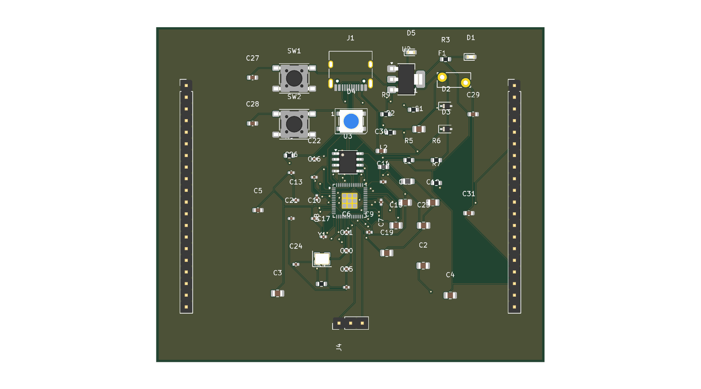

# RP2350 routed example

## Latest regenerated run

The full-board reconstruction routes with the installed FreeRouting pipeline
on six layers. Local generated artifacts are under
`reproductions/rp2350-reconstructed/generated/`:

- `rp2350_devboard_reconstructed.synth` — reconstructed Synth source
- `rp2350_devboard_reconstructed.layout.toml` — recovered placement sidecar
- `rp2350_devboard_freerouted_6layer.kicad_pcb` — routed KiCad board
- `rp2350_devboard_freerouted_6layer.png` — rendered review image
- `freerouted-6layer-drc.rpt` — native KiCad DRC report

FreeRouting completed with **0 unrouted signal nets**. The DRC report still
contains 14 ground-zone island items and two footprint-library warnings; this
is not production sign-off until those items are reviewed.

`rp2350_devboard_freerouting_clean.kicad_pcb` is a pre-generated compact KiCad
review artifact associated with the workflow in
[`docs/rp2350-agent-workflow.md`](../../docs/rp2350-agent-workflow.md). 

Reference dimensions: approximately **84.5 × 73.1 mm**.

Open the [KiCad board](rp2350_devboard_freerouting_clean.kicad_pcb) for an
interactive review.

The companion DRC report records the current review state. The authoritative
KiCad check currently reports **80 DRC violations** and **18 unconnected
items**. The 18 unconnected entries are zone-to-zone ground-island reports,
not ordinary signal-pad pairs, but they are still violations. This is an
example and review fixture, not production sign-off; silkscreen and footprint
library warnings also require engineering review.
